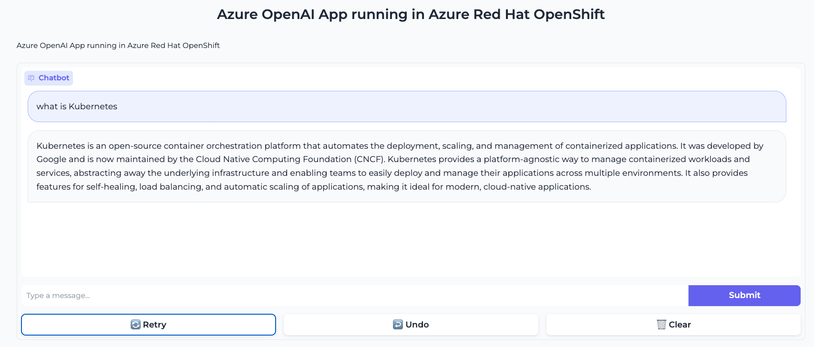

# Azure OpenAI ARO Application

Repository for Deploy A Gradio App with Azure OpenAI as a backend LLM within Azure Red Hat OpenShift (ARO) cluster.


* FrontEnd App deployed in ARO



* The FrontEnd uses Azure OpenAI GPT model as a Large Language Model Backend


* Azure OpenAI GPT Backend is deployed in Azure:


NOTE: The model used in Azure OpenAI is the GPT-3.5 Turbo, which can be changed to utilize other models such as GPT-4.

## Deploy FrontEnd App that uses Azure OpenAI

```md
kubectl apply -k manifests/overlays/ocp
```

NOTE: Use ```kubectl apply -k manifests/overlays/k8s``` if you want to deploy it in Vanilla K8s

## Add Azure OpenAI credentials into Kubernetes secrets

* First, set your environment variables with the plain text values in your terminal:

```md
export OPENAI_API_BASE="https://MY_FANCY_URL.openai.azure.com/"
export OPENAI_API_KEY="your-api-key"
export NAMESPACE="aro-azureopenai"
```

* Deploy the secret in the namespace

```md
cat <<EOF | kubectl apply -n $NAMESPACE -f -
apiVersion: v1
kind: Secret
metadata:
  name: azure-openai
type: Opaque
data:
  OPENAI_API_BASE: $(echo -n "$OPENAI_API_BASE" | base64)
  OPENAI_API_KEY: $(echo -n "$OPENAI_API_KEY" | base64)
EOF
```

## Local Development

* Export OPENAI_API_BASE and OPEN_API_KEY:

```md
export OPENAI_API_BASE="xxx"
export OPENAI_API_KEY="xxx"
```

* Run the main python program:

```md
python main.py
```